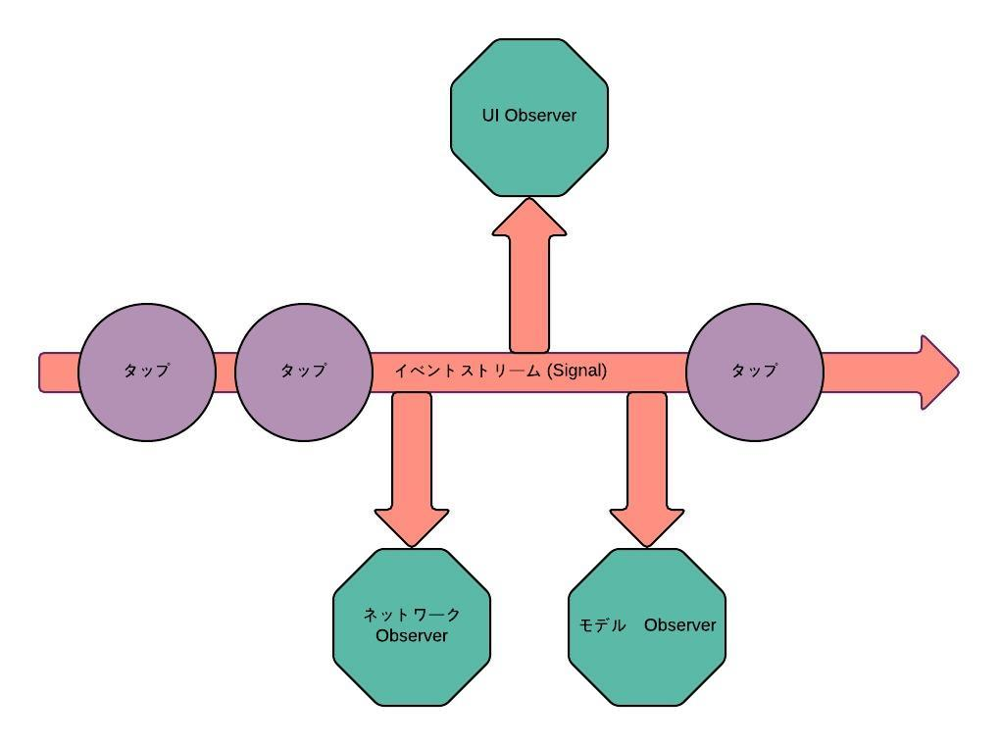

#[fit]ReactiveCocoa入門
Signals, SignalProducers and Events! Oh my!

---

###自己紹介
VASILYのiOSエンジニアにこらすと申します。
OSSとかSwift Evolutionに貢献しています。
最近Swift Evolution SE-0053を提案してSwift3.0に採用されました！

github.com/**nirma**
[@din0sr](https://twitter.com/din0sr)

---

###FRP(Functional Reactive Programming)<br />のメリットは？
* コードノイズが減らせます
* @IBAction, NSNotificationCenterおよびCallback/Delegateのパターンよりも、もっとシンプルな実装ができます。

---

###例: リフレッシュボタンのクリックイベント (一般的な実装)

```swift
@IBAction func refreshButtonClicked(sender: AnyObject) {
    updateViewForState(.Loading)
    performNetworkRequest() {
        updateModel()
        dispatch_async(dispatch_get_main_queue()) {
            updateViewForState(.Success)
        }
    }
}
```
 
---

###`refreshButtonClicked:`が呼ばれたら

1. ボタンの表示を更新
2. ローディングアイコンを表示
3. ネットワークリクエスト
4. リクエストが完了したらCallbackでUIとモデルを更新する

一つのメソッドの中に複数の責任の処理が固まっていて良くない。
シンプルに書き換えたい。

---

ループ処理だとこんなイメージ

Before:

```swift
var counter = 0 
var animationImages = [UIImage]()

while counter < 10 {
    let imageString = "animation_image_\(counter)"
    if let image = UIImage(named: imageString) {
        animationImages += [image]
    }
}
```

---

ループ処理だとこんなイメージ

After:

```swift
(0..<10).flatMap { UIImage(named: "animation_image_\($0)") }
```

---

#[fit] **RAC** FTW!

---

#ReactiveCocoaとRxの違い

- Naming Convention
   - Rx: Hot Signal, Cold Signal
   - ReactiveCocoa: Signal, SignalProducer

- Cocoa専用API拡張

- よりシンプルな設計

- etc 

---



---

#YES, Signals!

`Signal`でイベントを受け取って`Observer`とか`Disposable`でSignal操作ができます。

---

#Events...

```swift
/// Signals must conform to the grammar:
/// `Next* (Failed | Completed | Interrupted)?`
public enum Event<Value, Error : ErrorType> {
    /// A value provided by the signal.
    case Next(Value)
    /// The signal terminated because of an error. No further events will be
    /// received.
    case Failed(Error)
    /// The signal successfully terminated. No further events will be received.
    case Completed
    /// Event production on the signal has been interrupted. No further events
    /// will be received.
    case Interrupted
    /// Whether this event indicates signal termination (i.e., that no further
    /// events will be received).
}
``` 

---

#Signals, cheap 

常に発生しうるイベントストリーム

- UIコントロール

- APIリクエスト

- DB Read / Write

- UINotificationCenter

- なんでも

---

###Signal作成と使い方

```swift
let (userNameTextSignal, observer) = Signal<String, NoError>.pipe()

userNameTextSignal.observeNext { userName in
    print("Next Event: \(userName)")
}

observer.sendNext("l")         // Next Event: l
observer.sendNext("la")        // NExt Event: la
observer.sendNext("lat")       // Next Event: lat
observer.sendNext("latt")      // Next Event: latn
observer.sendNext("lattn")     // Next Event: lattn
observer.sendNext("lattne")    // Next Event: lattne
observer.sendNext("lattner")   // Next Event: lattner
observer.sendCompleted()
```

---

###Signal's friends map, filter, reduce

[RAC Marbles](http://neilpa.me/rac-marbles/)

---

### Signal Operators in Action - filter

```swift
let (userNameTextSignal, observer) = Signal<String, NoError>.pipe()

let improvedUserNameTextSignal = userNameTextSignal.filter { $0.characters.count > 4 }

improvedUserNameTextSignal.observeNext { userName in
    print("Next Event: \(userName)")
}

observer.sendNext("lattn")
observer.sendNext("lattne")
observer.sendNext("lattner")
observer.sendCompleted()
```

---

### 既存のSignalから新しいSignalを作る

```swift
let (userNameTextSignal, observer) = Signal<String, NoError>.pipe()

let userNameValidSignal = userNameTextSignal.map {
    return $0.characters.count > 5
}

let backgroundColorSignal = userNameValidSignal.map {
    return $0 ? UIColor.greenColor() : UIColor.redColor()
}
```

---

### Signals & End of Life
swiftの`GeneratorType`と同じように一回`Signal`を使い終わったら再利用できない。

---

### SignalProducer (Cold Signals)

- SignalProducers は Signal のファクトリー
- Observeしないかぎり、処理は開始されない
- Signal Operators can be 'Lifted'

---

### SignalProducer - Nothing 

```swift
var userNameProducer = SignalProducer<String, NoError> { (observer, disposable) in
    ["foo", "bar", "zap", "bin", "fizz"].forEach { userName in
        print("Sending Username: \(userName)")
        observer.sendNext(userName) 
    }
}
```

---

### SignalProducer - Something

```swift
var userNameProducer = SignalProducer<String, NoError> { (observer, disposable) in
    ["foo", "bar", "zap", "bin", "fizz"].forEach { userName in
        print("Sending Username: \(userName)")
        observer.sendNext(userName) 
    }
}

userNameProducer.startWithNext { userName in
    print("Received Username: \(userName)")
}
```

---

#### output
```
Sending Username: foo
Received Username: foo
Sending Username: bar
Received Username: bar
Sending Username: zap
Received Username: zap
Sending Username: bin
Received Username: bin
Sending Username: fizz
Received Username: fizz
```

---

### SignalProducer - SignalProducerからSignalProducer作る

```swift
var userNameProducer = SignalProducer<String, NoError> { (observer, disposable) in
    ["foo", "bar", "zap", "bin", "fizz"].forEach { userName in
        print("Sending Username: \(userName)")
        observer.sendNext(userName) 
    }
}

userNameProducer.startWithNext { userName in
    print("Received Username: \(userName)")
}

let zCounterSignal = userNameProducer.map { $0.containsString("z") }
zCounterSignal.startWithNext {
    if $0 {
        print("Contains z!")
    } else {
        print("No z here.")
    }
}
```

---

#### output
```
No z here.
No z here.
Contains z!
No z here.
Contains z!
```

---

### RAC4.0のAPI変更
- Based on Swift 2.0
- RACSignalがなくなりました (This is a lie.)
- RAC3.0からRACSignal (HOT, COLD) が Signal, SignalProducerに変更
- ~~Global Functions~~ `Protocol Extensions`
- `|>`(Pipe-Left)は普通の`.`(Dot Operator)に変更

まだ`RACSignal`を返すメソッドが多く残っているけど↓

```swift
searchBox.rac_textSignal().toSignalProducer()
```

[RAC change log](https://github.com/ReactiveCocoa/ReactiveCocoa/blob/master/CHANGELOG.md)

---

### まとめ
- RAC4はいいFRPライブラリとして設計が良い
- コミュニティがヘルシーで進化も早いけど、まだレガシーコードが残っているので'5/5'を上げられないです
- Cocoa拡張は便利だけど、ライブラリを肥大化させている
- Learning Curve is steep